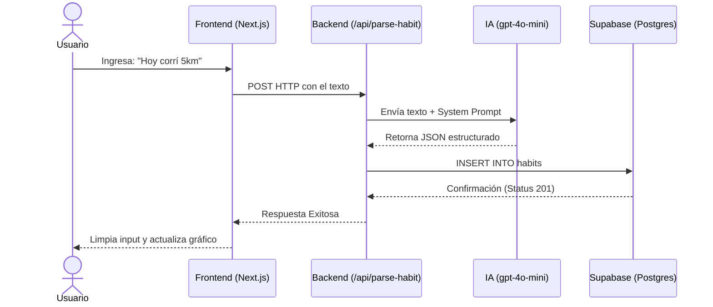
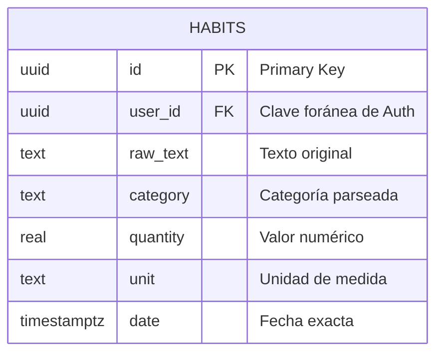

# Smart Habit Tracker 🧠

Sistema de Rastreo de Hábitos con Procesamiento de Lenguaje Natural (PWA Serverless).
El usuario ingresa sus hábitos en lenguaje natural (ej: "Hoy corrí 5km y leí 20 páginas") y la IA estructura los datos automáticamente.

Este proyecto es con el unico fin de aprender APIs de IA, Gestion de Bases de Datos con Supabase y FrontEnd.

## Stack Tecnológico
* **Frontend/Backend:** Next.js (App Router)
* **Base de Datos:** Supabase (PostgreSQL)
* **Inteligencia Artificial:** OpenAI API (gpt-4o-mini)
* **Estilos:** Tailwind CSS

## Cómo levantar el proyecto
1. Instalar dependencias: `npm install`
2. Correr servidor local: `npm run dev`
3. Abrir [http://localhost:3000](http://localhost:3000)

