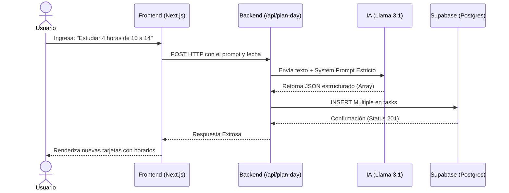
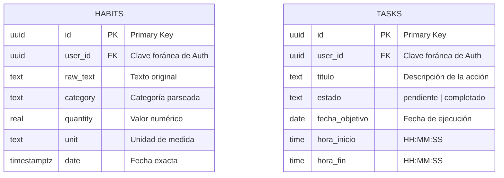

# Smart Habit Tracker & Planner (Life OS) 
Un ecosistema integral de productividad serverless impulsado por procesamiento de lenguaje natural (NLP). La aplicación permite al usuario gestionar su vida diaria escribiendo de forma intuitiva, delegando en un motor de inteligencia artificial la tarea de estructurar, agendar y organizar la información. Este proyecto fue desarrollado con un enfoque puramente educativo para dominar la integración de APIs de IA en tiempo real, la gestión avanzada de bases de datos relacionales y el diseño de interfaces modernas y modulares. 
## Características Principales 
* **Rastreador de Hábitos Semántico:** Ingreso de actividades cotidianas en lenguaje natural (ej: *"Hoy corrí 5km y estudié 3 horas"*). La IA procesa, categoriza y extrae métricas cuantitativas al instante. 
* **Planificador Diario Inteligente (`/planner`):** Calendario mensual interactivo con un input central de IA. Detecta intenciones de agenda y extrae horarios explícitos (ej: *"Mañana voy a estudiar Java de 10 a 14"*), bloqueando las franjas horarias de forma automática en la agenda. 
* **Gestión por Lotes (Bulk Management):** Control total de la interfaz mediante selección múltiple para eliminación masiva de tareas y modales emergentes interactivos para reajustes horarios manuales. 
* **Enfoque y Productividad (`/pomodoro`):** Temporizador Pomodoro integrado con validaciones lógicas de negocio (bloqueo de descansos inconsistentes) y alertas sonoras mediante síntesis matemática utilizando la *Web Audio API*. 
* **Interfaz de Alto Contraste:** Diseño minimalista con soporte nativo para **Modo Oscuro basado en la paleta oficial Nord Theme**, ofreciendo una experiencia visual relajante e integrada. 

## Stack Tecnológico 
* **Frontend & Backend:** Next.js 16 (App Router) 
* **Base de Datos & Seguridad:** Supabase (PostgreSQL) con políticas de seguridad a nivel de fila (RLS). 
* **Motor de IA:** Groq SDK utilizando el modelo de código abierto **Llama 3.1 (8B Instant)** de alta velocidad. 
* **Estilos y Temas:** Tailwind CSS + `next-themes` (Soporte de clases para modo oscuro/claro Nord). 
* **Manipulación de Fechas:** `date-fns` (Configuración regional en español). 

## Cómo levantar el proyecto 
1. **Clonar el repositorio e instalar dependencias:** 

```bash
git clone [https://github.com/tu-usuario/smart-habit-tracker.git](https://github.com/tu-usuario/smart-habit-tracker.git) 
cd smart-habit-tracker 
npm install
```

2. **Configurar las Variables de Entorno:** Crea un archivo `.env.local` en la raíz del proyecto y añade tus credenciales:

```
NEXT_PUBLIC_SUPABASE_URL=tu_url_de_supabase NEXT_PUBLIC_SUPABASE_ANON_KEY=tu_clave_anon_de_supabase GROQ_API_KEY=tu_api_key_de_groq
```

3. **Correr el servidor local de desarrollo:** Debido a la arquitectura de compilación del proyecto y el soporte PWA, levanta el entorno utilizando explícitamente la bandera de Webpack:

```Bash
npm run dev --webpack
```

4. Abrir [http://localhost:3000](https://www.google.com/search?q=http://localhost:3000) en tu navegador.

## Arquitectura del Sistema

### Flujo de Planificación Semántica



### Modelo de Datos (Esquema de Base de Datos)
